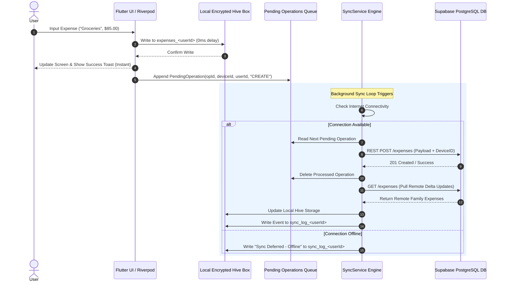

<div align="center">
  
  <h1>Spendly - Offline-First Collaborative Family Expense Tracker & Budget Manager</h1>
  <p><strong>A comprehensive, open-source, cross-platform Flutter application for multi-user household expense tracking, category budget management, AI-inspired financial analytics, and real-time cloud synchronization.</strong></p>

  [](https://flutter.dev)
  [](https://dart.dev)
  [](https://supabase.com)
  [](https://riverpod.dev)
  [](https://docs.hivedb.dev)
  [](LICENSE)
</div>

---

## 📌 Table of Contents
1. [Executive Summary & Product Vision](#-executive-summary--product-vision)
2. [Why Spendly? Solving Real Household Financial Challenges](#-why-spendly-solving-real-household-financial-challenges)
3. [Deep-Dive Feature Walkthrough](#-deep-dive-feature-walkthrough)
   - [1. Offline-First Storage & Queued Sync Engine](#1-offline-first-storage--queued-sync-engine)
   - [2. Multi-Tenant Family Collaboration](#2-multi-tenant-family-collaboration)
   - [3. Financial Analytics & Calendar Heatmap](#3-financial-analytics--calendar-heatmap)
   - [4. Category Budget Management & Threshold Alerts](#4-category-budget-management--threshold-alerts)
   - [5. AI Insights & Heuristic Pattern Detection](#5-ai-insights--heuristic-pattern-detection)
   - [6. PDF & CSV Data Export Engine](#6-pdf--csv-data-export-engine)
   - [7. Local Sync Event Logger & Device Installation ID](#7-local-sync-event-logger--device-installation-id)
4. [Screen-by-Screen Application Architecture](#-screen-by-screen-application-architecture)
5. [System & State Management Architecture](#-system--state-management-architecture)
   - [Riverpod Provider Dependency Graph](#riverpod-provider-dependency-graph)
   - [State Notifiers & Reactive State Lifecycle](#state-notifiers--reactive-state-lifecycle)
6. [Offline-First Sync Engine Algorithm](#-offline-first-sync-engine-algorithm)
7. [Database Schema & Local Storage Specification](#-database-schema--local-storage-specification)
   - [Supabase PostgreSQL Database Schema](#supabase-postgresql-database-schema)
   - [Hive Local Storage Boxes & Encrypted Schemas](#hive-local-storage-boxes--encrypted-schemas)
8. [Security, Data Isolation & Fault Tolerance](#-security-data-isolation--fault-tolerance)
9. [Developer Guide & Environment Setup](#-developer-guide--environment-setup)
10. [Building for Production (Android APK, App Bundle, iOS)](#-building-for-production-android-apk-app-bundle-ios)
11. [Testing & Quality Assurance](#-testing--quality-assurance)
12. [Frequently Asked Questions (FAQ)](#-frequently-asked-questions-faq)
13. [License & Author Information](#-license--author-information)

---

## 📌 Executive Summary & Product Vision

**Spendly** is a state-of-the-art mobile application engineered with **Flutter**, **Riverpod**, **Hive**, and **Supabase**. Built to bridge the gap between individual personal finance tools and complex enterprise accounting platforms, Spendly focuses specifically on **household collaborative finances**.

It allows family members to record daily expenses, set monthly category budgets, monitor visual spending trends, and coordinate household financial goals in real time. Because real-world usage happens everywhere - in supermarket basements, during international travel, or in low-coverage rural areas - Spendly is architected **offline-first**, guaranteeing 0ms input latency and 100% data availability regardless of cellular signal.

---

## 💡 Why Spendly? Solving Real Household Financial Challenges

Traditional mobile finance management applications suffer from three critical architectural flaws:

1. **Network Blocking Failure Mode:** Cloud-only apps display loading spinners or fail entirely when attempting to log an expense in places with poor reception (supermarket checkout lines, underground parking garages, or flights).
2. **Siloed Personal Budgets:** Most finance apps are designed for single users. Sharing expenses across family members usually requires tedious manual data entry or sharing account passwords.
3. **Multi-Device Synchronization Collisions:** When two family members enter expenses concurrently on separate phones, traditional cloud sync engines frequently overwrite or drop transactions.

### How Spendly Solves These Problems:
- 🚀 **0ms Local Response Times:** All writes execute immediately into encrypted local **Hive** key-value storage.
- 👨‍👩‍👧‍👦 **Multi-Tenant Family Workspaces:** Shared workspaces connected via unique 6-character family codes with Role-Based Access Control (Admin vs. Member).
- 🔄 **Queued Delta Sync Engine:** Offline operations are serialized into `PendingOperationModel` payloads tagged with `operationId`, `deviceId`, `userId`, and ISO timestamps. The sync engine resolves conflicts and pushes changes sequentially without data loss.

---

## ✨ Deep-Dive Feature Walkthrough

### 1. Offline-First Storage & Queued Sync Engine
- **Instant Local Input:** Expenses, budgets, and user settings save locally first. The UI updates instantly in 0 milliseconds.
- **Pending Operations Queue:** If offline, edits are queued in `pending_operations_<userId>`.
- **Background Synchronization:** When connected, `SyncService` pushes queued operations to Supabase using REST API calls and pulls remote updates.
- **Sync History Log:** Records up to 100 sync events in `sync_log_<userId>` (displaying status, pushed operation count, pulled records, and timestamps) for transparent production troubleshooting.

### 2. Multi-Tenant Family Collaboration
- **Family Workspace Creation:** Create a new family workspace (e.g., "Dudhat Family") or join an existing family using a 6-character code (e.g., `F7EBFB`).
- **Role-Based Permissions:**
  - 👑 **Admin (Family Creator):** Can update family settings, invite/remove members, and manage family budgets.
  - 👤 **Member:** Can view family balances, log expenses, and edit their own entries.
- **Multi-Device Tracking:** Each physical device receives a unique `deviceId` UUID upon installation. Operations carry `(operationId, deviceId, userId)` metadata for origin tracking and debugging.

### 3. Financial Analytics & Calendar Heatmap
- **Calendar Spending Heatmap:** A visual matrix showing daily spending intensity, allowing users to instantly spot high-spend days.
- **Interactive Pie Charts (FL Chart):** Category breakdowns (Food, Utilities, Transportation, Entertainment, Health, Shopping, etc.) with animated percentage callouts.
- **Expense Filtering & Search:** Search expenses by title, filter by category, payment method (Cash, Credit Card, Debit Card, UPI, Bank Transfer), or custom date ranges.

### 4. Category Budget Management & Threshold Alerts
- **Monthly Category Limits:** Define monthly spend limits per category (e.g., $500/month for Groceries).
- **Real-Time Visual Progress Indicators:** Progress bars with dynamic color transitions (Green $\rightarrow$ Amber $\rightarrow$ Red).
- **Proactive Threshold Alerts:**
  - 🟡 **70% Threshold Notice:** Soft alert when category spend exceeds 70% of monthly allocation.
  - 🔴 **90% Threshold Warning:** Prominent warning alert before exceeding budget limit.

### 5. AI Insights & Heuristic Pattern Detection
- **Subscription Pattern Recognition:** Automatically scans expense history to identify recurring billings (e.g., monthly Netflix, Spotify, or utility payments).
- **Savings Suggestions:** Provides actionable heuristic tips based on historical category spikes.

### 6. PDF & CSV Data Export Engine
- **CSV Data Export:** Generate structured raw CSV files containing timestamps, categories, amounts, payment methods, and notes.
- **Formatted PDF Statements:** Generate formatted PDF summary reports complete with headers, summary metrics, and categorized breakdowns suitable for printing, archiving, or tax filing.

### 7. Local Sync Event Logger & Device Installation ID
- **Device UUID Generator:** Assigns a persistent UUID (`deviceId`) to the installation on first boot.
- **Sync History Log:** Inspectable sync log for debugging missing expenses or checking sync timing.

---

## 📱 Screen-by-Screen Application Architecture

Spendly features an intuitive, modern UI built with custom Flutter widgets, glassmorphism card surfaces, and responsive navigation:

```text
┌─────────────────────────────────────────────────────────────────────────┐
│                        SPENDLY SCREEN NAVIGATION                        │
├─────────────────────────────────────────────────────────────────────────┤
│                                                                         │
│  [StartupScreen] ──► Checks Session ──► Logged In? ──┬── YES ──► [HomeScreen]
│                            │                         │
│                            NO                        └── NO  ──► [LoginScreen]
│                            ▼                                            │
│                     [RegisterScreen]                                    │
│                            │                                            │
│                            ▼                                            │
│               [JoinFamilyScreen] / [CreateFamilyScreen]                 │
│                            │                                            │ 
│                            ▼                                            │
│  ┌───────────────────────────────────────────────────────────────────┐  │
│  │               FLOATING BOTTOM NAVIGATION BAR CONTAINER            │  │
│  ├──────────────┬──────────────┬─────────────────┬───────────────────┤  │
│  │ [HomeScreen] │ [Expenses]   │ [BudgetsScreen] │ [AnalyticsScreen] │  │
│  │ Dashboard,   │ Full Filter  │ Progress Rings, │ Heatmap, Charts,  │  │
│  │ Heatmap &    │ & Search     │ 70%/90% Alert   │ Smart Suggestions │  │
│  │ Recent Feed  │ List         │ Cards           │ & Insights        │  │
│  └──────────────┴──────────────┴─────────────────┴───────────────────┘  │
│                            │                                            │
│                            ▼                                            │
│                    [ProfileScreen]                                      │
│             Family Code, Member Roster,                                 │
│             Sync Log Viewer, PDF/CSV Export                             │
└─────────────────────────────────────────────────────────────────────────┘
```

1. **Startup & Authentication Screens (`lib/features/auth/`):**
   - `StartupScreen`: Initializes Hive, inspects Supabase auth session, checks family membership, and routes seamlessly.
   - `LoginScreen` & `RegisterScreen`: Clean input forms with validation, error messaging, and password toggle.
2. **Family Setup Screens (`lib/features/family/`):**
   - `JoinFamilyScreen`: Clean 6-digit input code field with automatic uppercase formatting.
   - `CreateFamilyScreen`: Single-tap family workspace creation.
3. **Home Dashboard (`lib/features/expenses/views/home_screen.dart`):**
   - Displays current month total spend, budget health banner, daily spending heatmap widget, and recent transaction list.
   - Floating Action Button launches the `AddExpenseScreen` modal.
4. **All Expenses Screen (`lib/features/expenses/views/all_expenses_screen.dart`):**
   - Search bar with live query filtering, category dropdown pills, payment method selectors, and date range pickers.
5. **Budgets Screen (`lib/features/budgets/views/budgets_screen.dart`):**
   - Category budget list with active progress indicators, warning badges, and add/edit budget modal.
6. **Analytics Screen (`lib/features/analytics/views/analytics_screen.dart`):**
   - Category share pie charts, spending density heatmap calendar, and AI heuristics cards.
7. **Profile & Settings Screen (`lib/features/profile/views/profile_screen.dart`):**
   - Active user info, family join code generator/display, family member roster list, sync log modal trigger, and PDF/CSV export buttons.

---

## 🛠️ System & State Management Architecture

Spendly uses **Riverpod (StateNotifier)** for compile-safe, reactive state management across the application.

```text
                     ┌───────────────────────────┐
                     │    currentUserProvider    │
                     │  (Supabase Auth User)     │
                     └─────────────┬─────────────┘
                                   │
                                   ▼
 ┌───────────────────────────────────────────────────────────────────┐
 │                           AuthNotifier                            │
 │ (Manages AuthState, Session Checking, Box Switching on Auth Event)│
 └──────────────┬────────────────────┬───────────────────┬───────────┘
                │                    │                   │
                ▼                    ▼                   ▼
     ┌────────────────────┐ ┌─────────────────┐ ┌─────────────────┐
     │   FamilyNotifier   │ │ ExpenseNotifier │ │ BudgetNotifier  │
     │  (Family & Members)│ │ (Expense CRUD)  │ │ (Category Limits│
     └──────────┬─────────┘ └────────┬────────┘ └────────┬────────┘
                │                    │                   │
                └────────────────────┼───────────────────┘
                                     ▼
                          ┌─────────────────────┐
                          │     SyncService     │
                          │(Push Queue / Pull DB│
                          └─────────────────────┘
```

### Riverpod Provider Dependency Graph

- **`authProvider` (`AuthNotifier`)**: Listens to Supabase Auth state changes. Upon login, it triggers `HiveService.openUserBoxes(userId)` to switch local database scope atomically before emitting new auth states.
- **`familyProvider` (`FamilyNotifier`)**: Manages the current family metadata and member roster. Features an automatic remote fallback: if local Hive family storage is clean upon login, it automatically queries Supabase `family_members` and `families` tables over REST API.
- **`expenseProvider` (`ExpenseNotifier`)**: Handles expense creation, editing, deletion, and filtering. Writes to local Hive box immediately, queues a `PendingOperationModel`, and notifies `SyncService`.
- **`budgetProvider` (`BudgetNotifier`)**: Manages category budget thresholds, calculates monthly consumed percentages, and evaluates notice/warning conditions.
- **`syncProvider` (`SyncService`)**: Handles queue draining, delta fetching, retry policies, and sync event logging.

---

## 🔄 Offline-First Sync Engine Algorithm

The diagram below details the exact step-by-step lifecycle of an expense transaction from offline user input to cloud persistence:



---

## 🗄️ Database Schema & Local Storage Specification

### Supabase PostgreSQL Database Schema

Spendly's PostgreSQL cloud backend uses 5 tables protected by Row Level Security (RLS) policies:

```sql
-- 1. Families Table
CREATE TABLE public.families (
    id UUID PRIMARY KEY DEFAULT gen_random_uuid(),
    name TEXT NOT NULL,
    code VARCHAR(6) UNIQUE NOT NULL,
    created_by UUID REFERENCES auth.users(id) ON DELETE SET NULL,
    created_at TIMESTAMPTZ DEFAULT NOW()
);

-- 2. Family Members Table (Role-Based Access Control)
CREATE TABLE public.family_members (
    id UUID PRIMARY KEY DEFAULT gen_random_uuid(),
    family_id UUID REFERENCES public.families(id) ON DELETE CASCADE,
    user_id UUID REFERENCES auth.users(id) ON DELETE CASCADE,
    role VARCHAR(20) NOT NULL CHECK (role IN ('admin', 'member')),
    joined_at TIMESTAMPTZ DEFAULT NOW(),
    UNIQUE(family_id, user_id)
);

-- 3. Expenses Table
CREATE TABLE public.expenses (
    id UUID PRIMARY KEY DEFAULT gen_random_uuid(),
    family_id UUID REFERENCES public.families(id) ON DELETE CASCADE,
    user_id UUID REFERENCES auth.users(id) ON DELETE SET NULL,
    title TEXT NOT NULL,
    amount NUMERIC(12,2) NOT NULL,
    category TEXT NOT NULL,
    payment_method TEXT DEFAULT 'Cash',
    date TIMESTAMPTZ NOT NULL,
    notes TEXT,
    created_at TIMESTAMPTZ DEFAULT NOW()
);

-- 4. Budgets Table
CREATE TABLE public.budgets (
    id UUID PRIMARY KEY DEFAULT gen_random_uuid(),
    family_id UUID REFERENCES public.families(id) ON DELETE CASCADE,
    category TEXT NOT NULL,
    monthly_limit NUMERIC(12,2) NOT NULL,
    month INTEGER NOT NULL,
    year INTEGER NOT NULL,
    UNIQUE(family_id, category, month, year)
);

-- 5. Family Members Backup Audit Table (Triggers)
CREATE TABLE public.family_members_backup (
    id UUID PRIMARY KEY,
    family_id UUID NOT NULL,
    user_id UUID NOT NULL,
    role VARCHAR(20) NOT NULL,
    joined_at TIMESTAMPTZ,
    backed_up_at TIMESTAMPTZ DEFAULT NOW(),
    UNIQUE(family_id, user_id)
);
```

### Hive Local Storage Boxes & Encrypted Schemas

Every authenticated user receives isolated, encrypted Hive storage boxes formatted as `<base_name>_<userId>`:

| Box Base Name | Hive TypeAdapter | Description | Encryption |
| :--- | :--- | :--- | :--- |
| `profiles_<userId>` | `ProfileModelAdapter` (ID: 4) | Cached user display name, email, and preferences. | AES-256 (`HiveAesCipher`) |
| `families_<userId>` | `FamilyModelAdapter` (ID: 1) | Cached family metadata and join codes. | AES-256 (`HiveAesCipher`) |
| `family_members_<userId>` | `FamilyMemberModelAdapter` (ID: 2) | Roster of family members and their roles. | AES-256 (`HiveAesCipher`) |
| `expenses_<userId>` | `ExpenseModelAdapter` (ID: 0) | Offline expense transaction ledger. | AES-256 (`HiveAesCipher`) |
| `budgets_<userId>` | `BudgetModelAdapter` (ID: 3) | Monthly category budget allocations. | AES-256 (`HiveAesCipher`) |
| `pending_operations_<userId>` | `PendingOperationModelAdapter` (ID: 5) | Queue of offline edits pending cloud push. | AES-256 (`HiveAesCipher`) |
| `sync_metadata_<userId>` | `SyncMetadataModelAdapter` (ID: 6) | Last sync timestamps per table entity. | Unencrypted Key-Value |
| `sync_log_<userId>` | `Map<String, dynamic>` | Audit log storing last 100 sync events. | Unencrypted Key-Value |
| `guest_local` | Various | Default safety fallback storage open at boot. | AES-256 / Unencrypted |

---

## 🔒 Security, Data Isolation & Fault Tolerance

1. **AES-256 Storage Encryption:** Local Hive boxes containing user or expense data are encrypted using `HiveAesCipher`. The 256-bit key is generated securely using `Hive.generateSecureKey()` and persisted in platform secure storage.
2. **Atomic Box Opening:** `HiveService.openUserBoxes(userId)` ensures `_activeUserId` is updated **only after** all 9 user boxes finish opening in memory.
3. **Hierarchical Fallback Resolution:** If a Flutter widget renders during an async box transition, `HiveService._getOrFallback()` checks:
   - User-scoped box (`expenses_<userId>`)
   - Active guest box (`expenses_guest_local`)
   - Legacy base box (`expenses`)
   This prevents `StateError: Hive box is not open` crashes.
4. **Self-Healing Storage Recovery:** If a local box file experiences disk corruption or an encryption key mismatch, `_openEncryptedBox()` automatically catches the error, deletes the corrupted local file, and recreates a clean box without crashing the app.
5. **Supabase Row Level Security (RLS):** Database security policies enforce that family members can only read/write expenses belonging to their verified `family_id`.

---

## 🚀 Developer Guide & Environment Setup

### Prerequisites
- [Flutter SDK](https://docs.flutter.dev/get-started/install) (v3.11.3 or higher)
- [Dart SDK](https://dart.dev/get-started) (v3.0 or higher)
- Android Studio / VS Code with Flutter extension
- JDK 17 / Android SDK (API Level 21 minimum)

### Local Configuration Setup

1. **Clone repository**
   ```bash
   git clone https://github.com/Preetdudhat03/spendly.git
   cd spendly
   ```

2. **Install Flutter dependencies**
   ```bash
   flutter pub get
   ```

3. **Generate Configuration File**
   Create `lib/core/constants/config.dart`:

   ```dart
   class AppConfig {
     // Set to true to enable Offline Local Sandbox mode without Supabase connection
     static const bool forceSandboxMode = false;

     static const String supabaseUrl = forceSandboxMode 
         ? '' 
         : String.fromEnvironment('SUPABASE_URL', defaultValue: 'https://YOUR_SUPABASE_PROJECT_ID.supabase.co'); 
         
     static const String supabaseAnonKey = forceSandboxMode 
         ? '' 
         : String.fromEnvironment('SUPABASE_ANON_KEY', defaultValue: 'YOUR_SUPABASE_ANON_KEY'); 

     static bool isSupabaseInitialized = false;

     static bool get isSupabaseConfigured {
       return supabaseUrl.isNotEmpty &&
           supabaseUrl.startsWith('http') &&
           supabaseAnonKey.isNotEmpty &&
           supabaseAnonKey.length > 20;
     }
   }
   ```

4. **Launch Application**
   ```bash
   flutter run
   ```

---

## 📦 Building for Production (Android APK, App Bundle, iOS)

### Android Release APK
```bash
# Build universal production APK
flutter build apk --release

# Build split APKs per ABI (Optimized file size for 64-bit devices)
flutter build apk --target-platform android-arm64 --release
```
*Output location:* `build/app/outputs/flutter-apk/app-release.apk`

### Android App Bundle (for Google Play Store)
```bash
flutter build appbundle --release
```
*Output location:* `build/app/outputs/bundle/release/app-release.aab`

### iOS Release Build
```bash
flutter build ios --release
```

---

## 🧪 Testing & Quality Assurance

Spendly includes automated unit and widget test coverage:

```bash
# Run all unit and widget tests
flutter test

# Run static code analysis
flutter analyze
```

---

## ❓ Frequently Asked Questions (FAQ)

<details>
<summary><strong>Q: Does Spendly require a continuous internet connection?</strong></summary>
<br/>
<strong>No.</strong> Spendly is designed offline-first. Expenses, budgets, and heatmaps work instantly without network access. Pending transactions are automatically synced to the cloud when internet access is restored.
</details>

<details>
<summary><strong>Q: How do family members share expenses on separate devices?</strong></summary>
<br/>
One user creates a family workspace, generating a unique 6-character Join Code (e.g., <code>F7EBFB</code>). Other family members enter this code on their phones to join the workspace and sync expenses in real time.
</details>

<details>
<summary><strong>Q: What happens if two family members enter expenses while offline?</strong></summary>
<br/>
Each operation is assigned a unique <code>operationId</code>, <code>deviceId</code>, and <code>timestamp</code>. When both devices reconnect, `SyncService` processes operations sequentially, ensuring all entries are merged cleanly without overwrites.
</details>

<details>
<summary><strong>Q: Is local storage encrypted?</strong></summary>
<br/>
<strong>Yes.</strong> All sensitive local Hive boxes (`expenses`, `budgets`, `profiles`, `families`) are encrypted using 256-bit AES encryption (`HiveAesCipher`).
</details>

---

## 👨‍💻 License & Author Information

Developed with ❤️ by **Preet Dudhat**.

- 🐙 **GitHub Repository:** [Preetdudhat03/spendly](https://github.com/Preetdudhat03/spendly)
- 📄 **License:** MIT License - free for personal and educational use..
